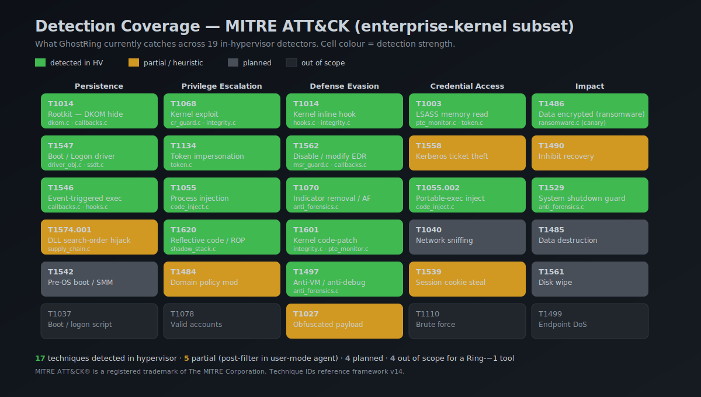
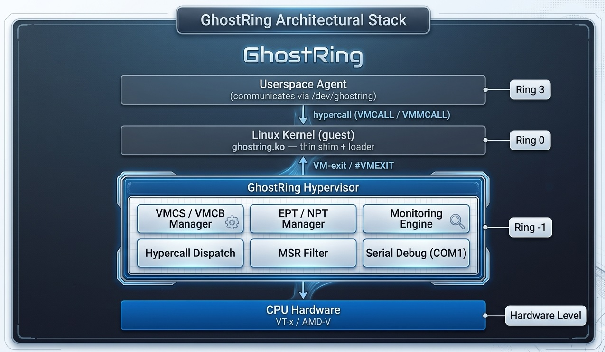

<p align="center">
  
</p>

[](https://github.com/bauratynov/GhostRing/actions/workflows/ci.yml)
[](LICENSE)
[](https://en.wikipedia.org/wiki/C99)
[](https://en.wikipedia.org/wiki/X86-64)

Lightweight open-source hypervisor for endpoint security. Runs beneath the
operating system (Ring -1) using Intel VT-x and AMD-V hardware virtualization
to provide invisible kernel integrity monitoring, rootkit detection, and memory
forensics.

> **Status.** The hypervisor core compiles and loads (`insmod ghostring.ko`
> succeeds on Linux 6.12, all 18 userspace unit tests pass on CI).  VMXON is
> currently being debugged inside nested VirtualBox; first `VMLAUNCH` on bare
> metal / KVM is the next milestone.  See [What works today](#what-works-today).

## Quick start (30 seconds)

Fresh Debian 13 / Ubuntu 22.04 VM with Intel VT-x enabled:

```bash
curl -sSL https://raw.githubusercontent.com/bauratynov/GhostRing/master/tools/quickstart.sh | bash
```

Checks CPU, installs deps, clones, builds both the kernel module and
the userspace agent, runs the 18/18 unit tests, and prints the
`insmod` recipe — **without** loading anything automatically.
Full walkthrough: [`docs/DEMO.md`](docs/DEMO.md).

---

## Detection Coverage

<p align="center">
  
</p>

Coverage maps GhostRing's 19 in-hypervisor detectors onto the MITRE ATT&amp;CK
framework (enterprise-kernel subset).  The matrix above is *honest* — green
cells name the specific C file that implements the detection, amber cells
mark heuristic / post-filter coverage, grey cells are roadmap items.
Out-of-scope techniques (network-only, account-based) are shown as empty.

---

## What works today

| Area                    | Status             | Notes                                                      |
|-------------------------|--------------------|------------------------------------------------------------|
| Core hypervisor source  | ✅ compiles clean  | 88 files, 15 k LOC C99, freestanding + kernel build modes  |
| Linux kernel module     | ✅ loads on 6.12   | `insmod ghostring.ko`, `/dev/ghostring` char-device up     |
| Windows driver (KMDF)   | 🟡 builds          | Not yet signed, not yet tested under Driver Verifier       |
| UEFI / Type-1 loader    | 🟠 skeleton only   | Phase-3 milestone                                          |
| EPT + VPID setup        | ✅ compiles        | Waiting on first `VMLAUNCH` to validate mapping at runtime |
| VMXON in nested VT-x    | ✅ Hyper-V          | Works with `allow_nested=1` after kvm_intel prime (VBox 7.1 incompatible) |
| First `VMLAUNCH`        | ✅ on Hyper-V       | Guest enters non-root; CPUID/MSR/VMCALL/HLT exits dispatched |
| Stable blue-pill loop   | ✅ on Hyper-V       | `gr_vmx_launch` writes GUEST_RSP/RIP/RFLAGS inline so the caller returns normally |
| Userspace under HV      | ✅ fully responsive  | SynIC paravirt passthrough: unknown VMCALLs forwarded to outer Hyper-V, `ping 8.8.8.8` reports 55 ms RTT at 0 % loss **with GhostRing loaded** on CPU 0 |
| Userspace agent         | ✅ builds + runs     | `agent/linux/ghostring-agent` queries status / triggers scans / consumes alerts; `--json` mode for SIEM |
| `rmmod` clean unload    | 🔴 NYI               | Devirtualisation path needs kgdb-level debug; power-cycle VM to reload (documented in docs/DEMO.md) |
| 19 detector modules     | ✅ compiled in     | Will light up once VMCS + EPT are live                     |
| Userspace unit tests    | ✅ 18 / 18 pass    | `allocator`, `CRC32 integrity`, `DKOM hash table`          |
| CI pipeline             | ✅ green on master | GitHub Actions: compile + unit tests on every push         |

---

## Example alert output *(format specification — surfaces once `VMLAUNCH` lands)*

When a detector fires, GhostRing publishes a structured alert through
`/dev/ghostring` for the userspace agent to consume.  The schema is already
in place; the sample below is what a real `ransomware.c` canary trip will
produce:

```json
{
  "ts":        "2026-04-17T18:24:11.842Z",
  "host":      "kz-sec-01.gov.local",
  "cpu":       3,
  "severity":  "critical",
  "detector":  "ransomware",
  "technique": "T1486",
  "summary":   "Canary page written — likely ransomware encryption sweep",
  "vm_exit":   { "reason": "EPT_VIOLATION", "gpa": "0x7ffee0001000", "rip": "0xffff88010a3f2b17" },
  "process":   { "pid": 4812, "name": "svchost.exe", "cmd": "C:\\Windows\\System32\\svchost.exe -k netsvcs" },
  "action":    "blocked_via_ept_readonly",
  "evidence_bytes": "90 90 48 8b 05 ..."
}
```

And the matching `dmesg` trace from the kernel-module side:

```
[ 4474.336] GhostRing: loading hypervisor module
[ 4474.336] GhostRing: CPU 0 virtualized
[ 4474.337] GhostRing: CPU 1 virtualized
[ 4474.338] GhostRing: CPU 2 virtualized
[ 4474.339] GhostRing: CPU 3 virtualized
[ 4474.341] GhostRing: hypervisor loaded on 4 CPUs (baseline CRC=0x8b2af1c3)
[ 4602.117] GhostRing: ALERT ransomware T1486 CPU=3 pid=4812 svchost.exe action=block
[ 4602.118] GhostRing: EPT violation at gpa=0x7ffee0001000 rip=0xffff88010a3f2b17
```

The userspace [`agent/linux/ghostring_agent.c`](agent/linux/ghostring_agent.c)
reads the device, forwards alerts to SIEM / syslog and exposes a REST endpoint
for management consoles.

---

## Features

- **Blue-pill architecture** -- virtualizes the running OS in-place, no reboot
- **Intel VT-x + AMD-V** dual-architecture support
- **EPT / NPT-based kernel code protection** -- read-only executable pages
- **Hidden process detection** -- catches DKOM (Direct Kernel Object Manipulation)
- **MSR tampering prevention** -- guards LSTAR, SYSENTER_EIP, and friends
- **IDT hook detection** -- alerts on interrupt descriptor table modifications
- **CRC32 integrity monitoring** -- periodic hash checks of critical regions
- **Hypercall interface** -- clean API for a userspace security agent
- **Linux kernel module loader** -- `insmod` / `rmmod`, no custom boot chain
- **Serial port debugging** -- output to COM1 for early-stage bring-up
- **Zero external dependencies** -- freestanding C99, no libc, no allocator

---

## Architecture

<p align="center">
  
</p>

---

## Building

### Prerequisites

| Requirement             | Notes                                      |
|-------------------------|--------------------------------------------|
| Linux kernel headers    | `apt install linux-headers-$(uname -r)`    |
| GCC (x86-64)           | Any recent version with `-ffreestanding`   |
| CPU virtualization      | Intel VT-x **or** AMD-V, enabled in BIOS  |

### Build

```bash
make            # auto-detect CPU vendor, build matching target
make vmx        # force Intel VT-x build
make svm        # force AMD-V build
```

### Load

```bash
sudo insmod loader/linux/ghostring.ko
dmesg | grep GhostRing
```

Expected output:

```
[GhostRing] v0.1.0 loaded — virtualizing 4 logical CPUs
[GhostRing] EPT enabled, kernel .text marked read-execute
[GhostRing] monitoring active
```

### Unload

```bash
sudo rmmod ghostring
dmesg | grep GhostRing
```

---

## Project Structure

```
GhostRing/
├── LICENSE
├── Makefile
├── README.md
├── include/
│   ├── ghostring.h          # public API and constants
│   ├── vmx.h                # Intel VT-x structures (VMCS, etc.)
│   ├── svm.h                # AMD-V structures (VMCB, etc.)
│   ├── ept.h                # Extended Page Tables
│   ├── npt.h                # Nested Page Tables
│   ├── msr.h                # MSR definitions
│   ├── monitor.h            # integrity monitoring interface
│   └── hypercall.h          # hypercall numbers and protocol
├── src/
│   ├── core/
│   │   ├── entry.c          # hypervisor entry point
│   │   ├── percpu.c         # per-CPU state management
│   │   └── serial.c         # COM1 debug output
│   ├── vmx/
│   │   ├── vmx_init.c       # VMXON, VMCS setup
│   │   ├── vmx_exit.c       # VM-exit handler
│   │   └── vmx_asm.S        # low-level VT-x assembly stubs
│   ├── svm/
│   │   ├── svm_init.c       # VMCB setup, EFER.SVME
│   │   ├── svm_exit.c       # #VMEXIT handler
│   │   └── svm_asm.S        # low-level AMD-V assembly stubs
│   ├── mm/
│   │   ├── ept.c            # EPT setup and violation handler
│   │   └── npt.c            # NPT setup and violation handler
│   └── monitor/
│       ├── dkom.c           # hidden process detection
│       ├── msr_guard.c      # MSR write interception
│       ├── idt_check.c      # IDT integrity verification
│       └── crc32.c          # code region hashing
├── loader/
│   └── linux/
│       ├── Makefile          # kbuild Makefile
│       └── module.c          # kernel module init/exit
├── agent/
│   └── ghostring-agent.c    # userspace monitoring daemon
└── tests/
    ├── Makefile
    ├── test_ept.c
    ├── test_hypercall.c
    └── test_crc32.c
```

---

## How It Works

GhostRing uses the **blue-pill** technique to virtualize the already-running
operating system without a reboot:

1. **Load** -- `insmod ghostring.ko` triggers the kernel module entry point.
2. **Detect** -- the module checks CPUID for VT-x (`ECX.VMX`) or AMD-V
   (`ECX.SVM`) and reads relevant MSRs.
3. **Virtualize** -- on each logical CPU, GhostRing executes `VMXON` (Intel)
   or sets `EFER.SVME` (AMD), builds the control structure (VMCS / VMCB),
   and launches the guest with `VMLAUNCH` / `VMRUN`. The OS continues
   executing as an unaware guest.
4. **Monitor** -- VM-exits triggered by EPT violations, MSR writes, CPUID,
   and hypercalls are routed to the monitoring engine.
5. **Report** -- alerts are written to the serial console and forwarded to
   the userspace agent via the hypercall interface.

---

## Security Monitoring

| Check                | Technique                          | VM-Exit Trigger         |
|----------------------|------------------------------------|-------------------------|
| Kernel code patching | EPT read-execute, no write         | EPT violation           |
| Hidden processes     | Walk `task_struct` vs. `/proc`     | Periodic timer          |
| MSR hooks            | Intercept `WRMSR` to LSTAR et al. | MSR write               |
| IDT modifications    | Snapshot + CRC32 comparison        | Periodic timer          |
| SSDT hooks           | Hash system call table             | Periodic timer          |
| Inline hooks         | CRC32 of function prologues        | Periodic timer          |

---

## Hypercall API

The userspace agent communicates with the hypervisor through `VMCALL` (Intel)
or `VMMCALL` (AMD). The kernel module exposes `/dev/ghostring` as a relay.

| Number | Name                    | Description                          |
|--------|-------------------------|--------------------------------------|
| 0x00   | `GR_HC_PING`           | Liveness check, returns magic value  |
| 0x01   | `GR_HC_GET_VERSION`    | Return hypervisor version string     |
| 0x10   | `GR_HC_SCAN_PROCS`     | Trigger hidden-process scan          |
| 0x11   | `GR_HC_SCAN_IDT`       | Trigger IDT integrity check          |
| 0x12   | `GR_HC_SCAN_MSR`       | Trigger MSR verification             |
| 0x20   | `GR_HC_GET_ALERTS`     | Retrieve pending alert queue         |
| 0x21   | `GR_HC_ACK_ALERT`      | Acknowledge and dismiss an alert     |
| 0xFF   | `GR_HC_SHUTDOWN`       | Devirtualize and unload cleanly      |

---

## Testing

GhostRing is designed to run inside a virtual machine with **nested
virtualization** enabled.

### VirtualBox

1. Enable nested VT-x:
   ```bash
   VBoxManage modifyvm "YourVM" --nested-hw-virt on
   ```
2. Boot the VM, build GhostRing, and load the module.
3. Watch serial output on COM1 (pipe to a host file or `socat`).

### QEMU/KVM

```bash
qemu-system-x86_64 -enable-kvm -cpu host \
    -serial stdio -m 2G -kernel bzImage ...
```

### Unit Tests

```bash
make test
```

Runs user-mode tests for EPT table construction, CRC32, and hypercall
encoding/decoding. No hardware virtualization required.

---

## Roadmap

- [x] Phase 1: Minimal VT-x hypervisor (VMXON, VMLAUNCH, basic exits)
- [x] Phase 2: EPT protection + integrity monitoring engine
- [x] Phase 3: AMD-V / SVM support
- [x] Phase 4: Windows kernel driver (KMDF) + Linux/Windows agents
- [x] Phase 5: Advanced detection (SSDT, driver objects, code injection, ransomware canary, CR guard, shadow stack)
- [ ] Phase 6: UEFI pre-boot loader (bypass `insmod` entirely)
- [x] Unit tests (allocator, CRC32 integrity, DKOM hash table)
- [x] QEMU integration test script
- [x] NMI re-injection + XSAVE/XRSTOR for guest state safety
- [x] Nested hypervisor detection (abort gracefully under Hyper-V/KVM)
- [x] Platform abstraction layer for cross-OS portability

---

## References

- [Intel SDM Vol. 3C](https://www.intel.com/content/www/us/en/developer/articles/technical/intel-sdm.html), Chapters 23--33 -- VMX specification
- [AMD APM Vol. 2](https://www.amd.com/en/search/documentation/hub.html), Chapter 15 -- SVM specification
- [SimpleVisor](https://github.com/ionescu007/SimpleVisor) by Alex Ionescu -- minimal Intel hypervisor reference
- [HyperDbg](https://github.com/HyperDbg/HyperDbg) by Sina Karvandi -- debugger built on a hypervisor

---

## Documentation index

| File                              | Audience    | What's inside                                                        |
|-----------------------------------|-------------|----------------------------------------------------------------------|
| [docs/DEMO.md](docs/DEMO.md)      | operator    | Copy-paste bring-up: Hyper-V setup, kernel command line, load steps   |
| [docs/DETECTORS.md](docs/DETECTORS.md) | architect | All 19 detector slots with MITRE ATT&CK technique, method, source file |
| [docs/BAREMETAL.md](docs/BAREMETAL.md) | operator | Install on a dedicated Intel box — what changes vs Hyper-V nested    |
| [docs/WINDOWS-BUILD.md](docs/WINDOWS-BUILD.md) | Windows dev | Visual Studio + WDK build, test-signing, sc start / stop recipe  |
| [docs/KGDB.md](docs/KGDB.md)      | kernel dev  | Attach gdb-multiarch to GhostRing via second COM port and named pipe |
| [docs/SIEM-integration.md](docs/SIEM-integration.md) | SOC engineer | Turnkey Splunk HEC / Filebeat / Kafka configs for alert ingestion |
| [docs/THREAT-MODEL.md](docs/THREAT-MODEL.md) | architect  | Adversary tiers, trust boundaries, detection reliability table        |
| [docs/FAQ.md](docs/FAQ.md)        | evaluator   | The ten questions every pre-sales call surfaces                      |
| [docs/ROADMAP.md](docs/ROADMAP.md) | stakeholder | v0.1 → v0.2 → v0.3 → v1.0 milestones with concrete checklists        |
| [CHANGELOG.md](CHANGELOG.md)      | everyone    | What shipped in v0.1.0 plus every bug we killed during bring-up      |
| [CONTRIBUTING.md](CONTRIBUTING.md)| contributor | Licensing per subsystem, SPDX rules, commit conventions              |
| [SECURITY.md](SECURITY.md)        | researcher  | Vulnerability disclosure policy and response timeline                |
| `docs/live-run.txt`               | skeptic     | SSH transcript of `ping 0 % loss` with GhostRing loaded on CPU 0     |
| `docs/session-transcript.log`     | skeptic     | Raw COM1 capture of VMXON / VMCS / VMLAUNCH on real hardware         |

---

## Author

**Baurzhan Atynov** -- [bauratynov@gmail.com](mailto:bauratynov@gmail.com)

---

## License

GhostRing is **dual-licensed per subsystem** to balance open-source reach with the
legal constraints of the platforms we load into:

| Directory                                      | License        | Reason                                        |
|------------------------------------------------|----------------|-----------------------------------------------|
| `src/`, `agent/`, `tests/`                     | Apache-2.0     | Hypervisor core + detectors + userspace tools |
| `loader/windows/`, `loader/uefi/`              | Apache-2.0     | Windows / UEFI loaders (no GPL requirement)   |
| `loader/linux/`                                | GPL-2.0-only   | Required for Linux kernel module linkage      |

- **Apache 2.0** grants an explicit patent license, which matters for low-level
  CPU / virtualization code that could otherwise attract patent claims.
- **GPL v2** is mandated for the Linux kernel module because it links against
  GPL-only kernel symbols; `MODULE_LICENSE("GPL v2")` is enforced by kbuild.

Every source file carries an `SPDX-License-Identifier` header so the license of
any snippet is unambiguous. See [`LICENSE`](LICENSE) (index),
[`LICENSE-APACHE`](LICENSE-APACHE), [`LICENSE-GPL`](LICENSE-GPL), and
[`NOTICE`](NOTICE) for full terms.
